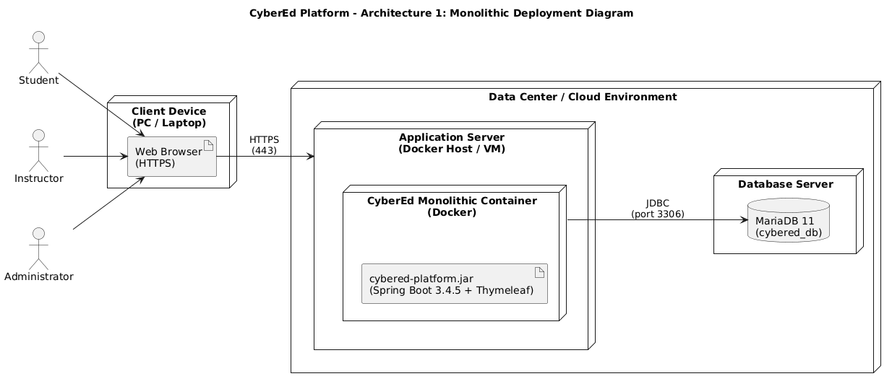
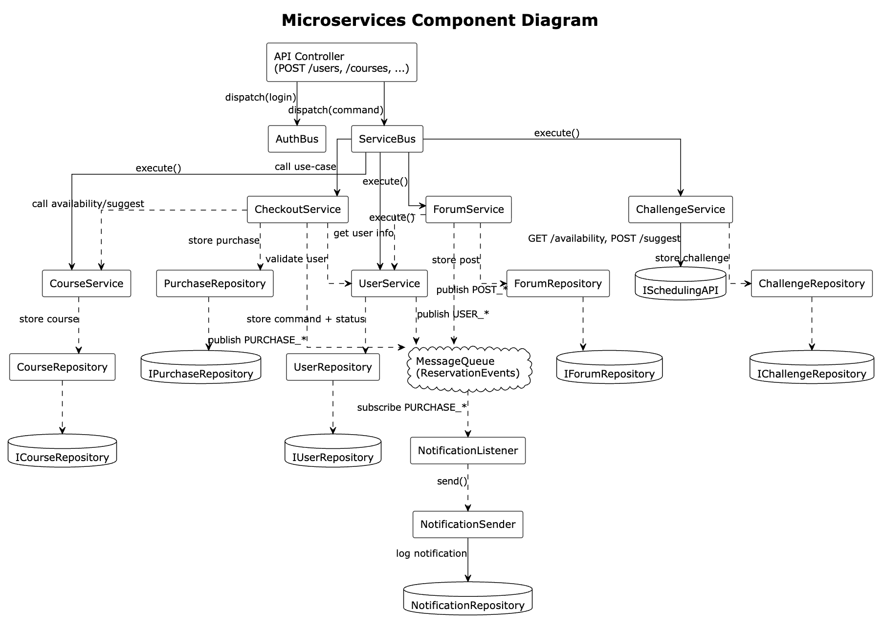
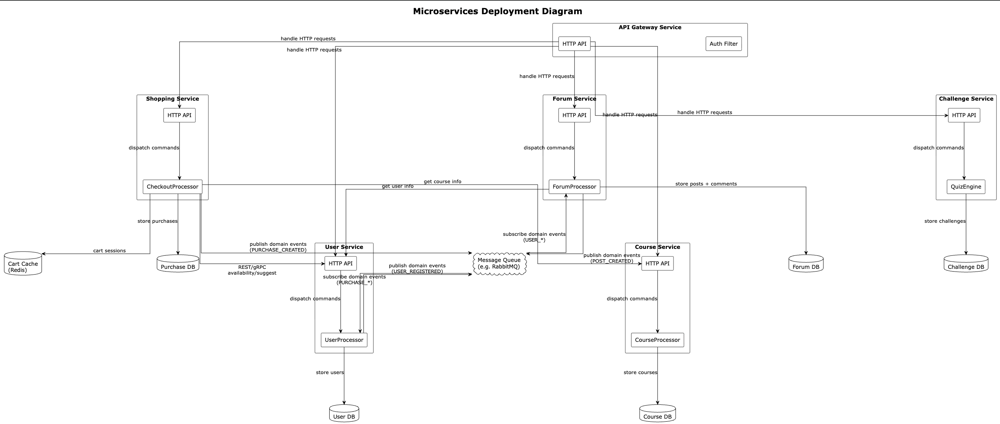
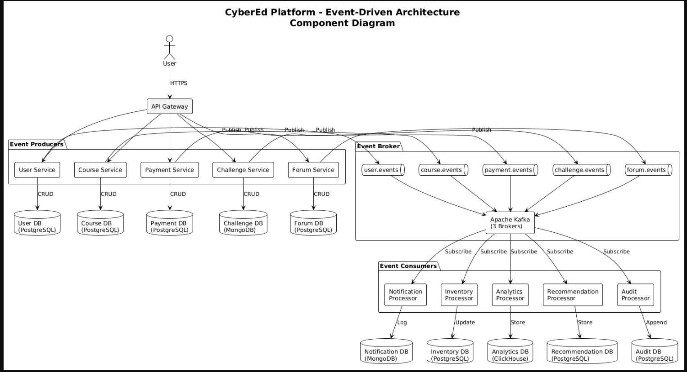
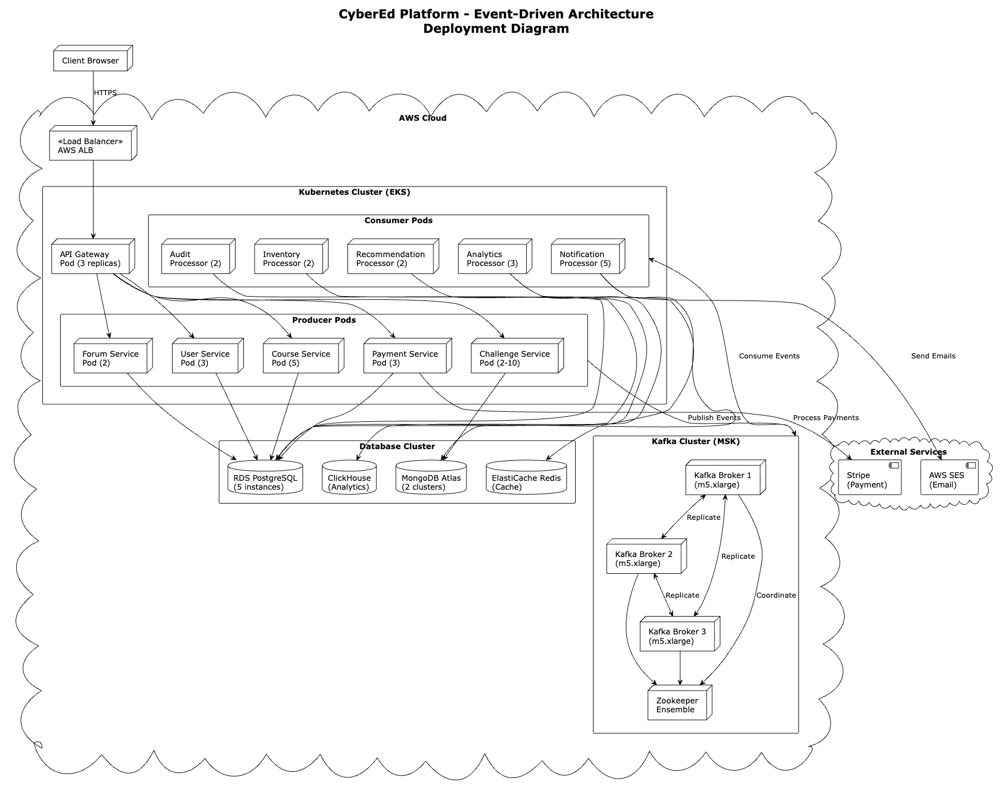

# CyberEd Platform - Architecture Analysis

**Course:** Software Design Techniques  
**Team Members:**
- Petre George-Alexandru, group 1241EB
- Ionescu Rares-Andrei, group 1241EB
- Leonte Robert, group 1241EB

**Date:** November 20, 2025

---

## Table of Contents

1. [Architecture 1: Monolithic Architecture](#architecture-1-monolithic-architecture)
2. [Architecture 2: Microservices Architecture](#architecture-2-microservices-architecture)
3. [Architecture 3: Event-Driven Architecture](#architecture-3-event-driven-architecture)
4. [Architecture Comparison](#architecture-comparison)
5. [Recommendation](#recommendation)

## Architecture 1: Monolithic Architecture

### Overview

In a monolithic architecture, the entire application is built, packaged, and deployed as a single, unified codebase. All functional modules—such as course management, challenges, e-commerce, authentication, and forum logic—are implemented inside one application runtime and share the same memory space, framework stack, and deployment lifecycle.
For the CyberEd Platform, this means that the presentation layer, business logic, and data access components all reside within a single Spring Boot application, delivered as one executable JAR (or one Docker image). This architecture emphasizes simplicity, coherence, and ease of initial development while relying on a straightforward deployment pipeline.

### Structure

The monolithic system follows a traditional layered architecture, where responsibilities are cleanly separated into logical tiers:

   -Presentation Layer (Thymeleaf MVC Controllers)
    Handles HTTP requests, renders server-side views, manages session state, and provides the UI endpoints used by students, instructors, and administrators.

   -Business Logic Layer (Spring Services)
    Contains the core domain logic for courses, challenges, e-commerce operations, forums, user management, and administrative functions. Services coordinate workflows, enforce validation rules, and connect the UI with the data access components.

   -Data Access Layer (Spring Data JPA)
    Represents repositories that abstract database operations. Each repository maps directly to a specific domain aggregate (courses, challenges, users, orders, etc.) and uses JPA/Hibernate to interact with the MariaDB relational database.

All layers execute within the same monolithic process, making internal calls lightweight and eliminating the overhead of inter-service communication.

### Component Diagram

### Deployment Diagram

### Advantages

Simple to Develop and Maintain in Early Stages - 
A single codebase allows developers to work without the complexity of distributed systems or remote service coordination.

Straightforward Deployment Pipeline - 
One application artifact (JAR/Docker image) is deployed at once, reducing operational overhead.

Highly Efficient Internal Communication - 
All components call each other using in-process method calls—faster than network-based communication.

Unified Data Model - 
The entire application shares one schema and transaction boundary, eliminating data consistency issues across services.

Easier for Small Teams - 
A monolith lowers architectural overhead and is manageable even with limited development resources.

### Disadvantages

Limited Scalability Options - 
Scaling requires replicating the entire application instance, even if only one component (e.g., challenges or forum) needs more capacity.

Tight Coupling Between Modules - 
Changes in one area can indirectly affect others, making large-scale modifications more error-prone.

Slower Build and Deployment Times as the System Grows - 
As the codebase expands, compiling, testing, and deploying the entire monolith becomes increasingly time-consuming.

Reduced Fault Isolation - 
A failure in one module (e.g., a bug in the shop system) can impact the entire application runtime.

Harder to Adopt New Technologies - 
Rewriting one part of the system in a different language or framework requires modifying the entire monolith.

### Suitability for CyberEd Platform

The monolithic architecture is well-suited for early-stage development of the CyberEd Platform, especially given the integrated nature of the system:

   -The project requires tight interaction between components such as authentication, courses, challenges, and user profiles—all of which communicate efficiently under a monolithic model.

   -The platform is being built by a relatively small team and benefits from the reduced operational overhead of a single deployable application.

   -Early development iterations are simplified: feature updates, refactoring, and testing occur within one codebase.

However, as CyberEd grows and its real-world usage increases, the monolith may encounter challenges—particularly in scalability and modular independence. In later stages, the system could migrate to a service-based or microservices architecture, separating heavily-used modules (challenges, course delivery, storefront) to enable independent scaling.

For the current development phase, the monolithic architecture provides an optimal balance between simplicity, performance, and productivity.

---

## Architecture 2: Microservices Architecture

### Overview

Microservices Architecture is a distributed system pattern where the application is decomposed into small, independently deployable services that communicate over the network. Each service owns its data and is responsible for a specific business capability.

Key components:
- API Gateway: Single entry point for all client requests
- Independent Services: User, Course, Shopping, Challenge, Forum services
- Message Queue: RabbitMQ for asynchronous event-driven communication
- Service-specific Databases: Each service has its own database

### Structure

#### Core Services

**User Service**
- Responsibilities: User registration, authentication, profile management
- API: POST /users, GET /users/{id}, PUT /users/{id}
- Database: User DB (PostgreSQL)
- Events Published: USER_REGISTERED, USER_UPDATED

**Course Service**
- Responsibilities: Course catalog, course management, inventory
- API: POST /courses, GET /courses, PUT /courses/{id}
- Database: Course DB (PostgreSQL)
- Dependencies: None (standalone service)

**Shopping Service**
- Responsibilities: Shopping cart, checkout, purchase processing
- API: POST /cart/items, POST /checkout, GET /purchases
- Database: Purchase DB (PostgreSQL), Cart Cache (Redis)
- Events Published: PURCHASE_CREATED, PURCHASE_COMPLETED
- Dependencies: Calls User Service and Course Service via REST/gRPC

**Challenge Service**
- Responsibilities: Interactive challenges, quiz engine, submissions
- API: POST /challenges, POST /submissions, GET /challenges/{id}
- Database: Challenge DB (MongoDB)
- Components: QuizEngine for challenge execution

**Forum Service**
- Responsibilities: Community posts, comments, moderation
- API: POST /posts, POST /comments, GET /posts
- Database: Forum DB (PostgreSQL)
- Events Published: POST_CREATED, COMMENT_ADDED
- Events Subscribed: USER_* (to sync user data)
- Dependencies: Calls User Service for user information

#### API Gateway

- Single entry point for all client requests
- Authentication filter for security
- Routes requests to appropriate microservices
- Load balancing and rate limiting

#### Message Queue (RabbitMQ)

- Asynchronous communication between services
- Event topics: USER_*, PURCHASE_*, POST_*
- Decouples services for better fault tolerance
- Enables eventual consistency

#### Communication Patterns

**Synchronous Communication (REST/gRPC)**
- Shopping Service → User Service (validate user)
- Shopping Service → Course Service (get course info, check availability)
- Forum Service → User Service (get user profile)

**Asynchronous Communication (Message Queue)**
- User Service publishes USER_REGISTERED events
- Shopping Service publishes PURCHASE_* events
- Forum Service publishes POST_* events
- Services subscribe to relevant events for data synchronization

### Component Diagram

### Deployment Diagram

### Advantages

**Independent Scalability**
- Each service scales independently based on load
- Challenge Service can scale during peak quiz times
- Shopping Service scales during sales periods
- Optimized resource utilization

**Technology Flexibility**
- Challenge Service uses MongoDB for flexible schema
- Other services use PostgreSQL for relational data
- Redis for high-performance cart caching
- Choose best tool for each job

**Independent Deployment**
- Deploy services without affecting others
- Faster release cycles (weekly vs monthly)
- Reduced deployment risk
- Easy rollback of individual services

**Team Autonomy**
- Teams own services end-to-end
- Parallel development possible
- Clear service boundaries
- Reduced coordination overhead

**Fault Isolation**
- Failure in Forum Service doesn't crash Shopping
- Circuit breakers prevent cascading failures
- Graceful degradation possible
- Better overall system resilience

**Focused Codebase**
- Smaller, more maintainable codebases per service
- Easier to understand and modify
- Faster onboarding for new developers
- Reduced cognitive load

### Disadvantages

**Increased Operational Complexity**
- 6+ services to deploy and monitor
- Requires container orchestration (Kubernetes)
- Complex logging and tracing across services
- Need for dedicated DevOps expertise

**Network Latency**
- Service-to-service communication adds overhead
- Shopping cart checkout: 3 network calls (User → Course → Purchase)
- Response time: 200-400ms vs 50-100ms for monolithic
- Network failures must be handled

**Data Consistency Challenges**
- No distributed transactions across services
- Eventual consistency model required
- Complex saga patterns for multi-service operations
- Difficult to maintain referential integrity

**Testing Complexity**
- Integration testing requires all services running
- Complex test data setup across multiple databases
- End-to-end tests are fragile and slow
- Mocking service dependencies is error-prone

**Infrastructure Costs**
- Minimum 6 services + API Gateway + Message Queue
- Estimated cost: $500-800/month vs $55/month monolithic
- Requires Kubernetes cluster or managed container service
- 10-15x more expensive at small scale

**Development Overhead**
- Boilerplate code for each service (API, auth, logging)
- Service discovery and configuration management
- API versioning and backward compatibility
- Distributed debugging is difficult

**Distributed System Complexity**
- Network partitions and timeouts
- Idempotency requirements for retry logic
- Distributed tracing needed for debugging
- CAP theorem tradeoffs

### Suitability for CyberEd Platform

**Not Recommended for Current Stage**

While microservices architecture offers clear benefits such as independent scalability, fault isolation, and technology flexibility, the disadvantages significantly outweigh the advantages at CyberEd Platform's current scale:

- Current user base (100-1,000 users) doesn't justify the 10x infrastructure cost increase ($500-800/month vs $55/month)
- Team of 3 developers is insufficient to manage and maintain 6+ independent services
- Operational complexity (Kubernetes, distributed tracing, service orchestration) exceeds team capacity
- Shopping Service's need for strong consistency conflicts with distributed data management
- Network latency overhead (200-400ms) vs monolithic (50-100ms) degrades user experience at small scale

**Future Consideration**

Microservices becomes a viable and recommended architecture when:
- User base grows to 2,000+ concurrent users requiring independent service scaling
- Team expands to 6+ developers with microservices and distributed systems expertise
- Budget can support the increased infrastructure and operational costs
- Specific services (e.g., Challenge Service) need independent scaling for competitions or peak loads

---

## Architecture 3: Event-Driven Architecture

### Overview

Event-Driven Architecture is a pattern where system components communicate asynchronously through events rather than direct calls. Event producers publish events to an event broker, and event consumers subscribe to and process these events independently.

Key components:
- Event Producers: Business services that publish events
- Event Broker: Apache Kafka cluster for event routing
- Event Consumers: Specialized processors that react to events

### Structure

#### Event Producers

Producer services handle user requests and publish events when state changes occur:

**User Service**
- Events: UserRegistered, UserLoggedIn, ProfileUpdated
- Database: PostgreSQL

**Course Service**
- Events: CourseCreated, CourseUpdated, InventoryChanged
- Database: PostgreSQL

**Payment Service**
- Events: PaymentCompleted, PaymentFailed, RefundProcessed
- Database: PostgreSQL

**Challenge Service**
- Events: ChallengeStarted, ChallengeCompleted, SubmissionGraded
- Database: MongoDB

**Forum Service**
- Events: PostCreated, CommentAdded, PostModerated
- Database: PostgreSQL

#### Event Broker

Apache Kafka cluster with:
- 3 broker nodes for high availability
- Topics organized by domain
- 7-day event retention
- Throughput: 50,000+ messages/second

#### Event Consumers

**Notification Processor**
- Sends emails, push notifications
- Database: MongoDB

**Inventory Processor**
- Updates course stock
- Database: PostgreSQL

**Analytics Processor**
- Real-time metrics and dashboards
- Database: ClickHouse, Redis

**Recommendation Processor**
- Generates personalized recommendations
- Database: PostgreSQL

**Audit Processor**
- Writes immutable audit logs
- Database: PostgreSQL

### Event Flow Example

Course purchase flow:
1. User submits purchase
2. Payment Service processes payment synchronously
3. Payment Service publishes PaymentCompleted event
4. User receives response (300-500ms)
5. Consumers process event in parallel:
   - Notification: Send email
   - Inventory: Update stock
   - Analytics: Update metrics
   - Audit: Log transaction

### Component Diagram

### Deployment Diagram

### Advantages

**Loose Coupling**
- Producers don't know about consumers
- Easy to add new consumers without modifying producers
- Independent development and deployment

**Scalability**
- Consumers scale independently based on load
- Parallel event processing
- Fast user response times (300ms vs 2-3 seconds)

**Fault Tolerance**
- No cascading failures
- Event persistence allows recovery
- Automatic retry mechanisms

**Asynchronous Processing**
- Non-blocking operations
- Background processing for long-running tasks
- Improved user experience

**Audit Trail**
- Complete event history
- Event replay capability
- Time travel debugging

**Extensibility**
- Easy to add new features
- A/B testing support
- Gradual feature rollout

### Disadvantages

**Eventual Consistency**
- Data may be stale for 2-5 seconds
- Complex conflict resolution needed
- Problematic for transactional operations

**Increased Complexity**
- Distributed system patterns required
- Difficult debugging across multiple services
- Steep learning curve for team

**Infrastructure Overhead**
- Kafka cluster management required
- Kubernetes orchestration complexity
- Extensive monitoring needed

**High Costs**
- Infrastructure: $8,000/month vs $55/month for monolithic
- Requires dedicated DevOps team
- 145x more expensive at small scale

**Message Duplication**
- At-least-once delivery guarantees
- All consumers must be idempotent
- Complex deduplication logic required

**Schema Evolution**
- Breaking changes affect multiple consumers
- Version management complexity
- Coordination overhead between teams

**Testing Complexity**
- Async testing challenges
- Complex test setup requirements
- Timing-dependent, flaky tests

### Suitability for CyberEd Platform

**Not Recommended for Current Stage**

Event-driven architecture is not suitable for CyberEd Platform's current needs:

- Scale mismatch: Optimized for 10,000+ concurrent users, platform has 100-1,000 users
- Team capacity: 3 developers lack distributed systems expertise
- Consistency needs: Core features require ACID transactions
- Cost: $8,000/month vs $55/month for monolithic (145x more expensive)
- Feature fit: 80% of features need strong consistency, only 20% benefit from async

**Future Consideration**

Event-driven becomes viable when:
- Scale reaches 5,000+ concurrent users
- Processing 10,000+ transactions/day
- Team has 10+ developers with distributed systems expertise
- Budget supports infrastructure costs

---

## Architecture Comparison

| Criteria | Monolithic | Microservices | Event-Driven |
|----------|-----------|---------------|--------------|
| **Scalability** | Vertical only; entire app scales | Independent service scaling | Independent component scaling |
| **Performance** | 50-100ms response time | 200-400ms response time | 300-500ms response time |
| **Complexity** | Low; single codebase | High; distributed system | Very high; async patterns |
| **Team Size Needed** | 3 developers | 6+ developers | 10+ developers |
| **Deployment** | Single artifact | 6+ services | Multiple producers/consumers |
| **Data Consistency** | ACID transactions | Eventual consistency | Eventual consistency |
| **Fault Isolation** | Low; shared runtime | High; isolated services | Very high; decoupled events |
| **Development Speed** | Fast; no distribution overhead | Moderate; service coordination | Slow; complex async flows |
| **Operational Overhead** | Minimal; one deployment | High; orchestration needed | Very high; Kafka + K8s |

### Key Insights

**Scalability**: Microservices and event-driven excel at independent scaling, but CyberEd's current 100-1,000 user base doesn't require this complexity.

**Complexity**: Monolithic architecture offers the lowest barrier to entry with a single codebase, while microservices and event-driven introduce distributed systems challenges that exceed our team's current capacity.

**Performance**: Monolithic delivers the fastest response times (50-100ms) due to in-process communication, while distributed architectures add network overhead.

**Consistency**: CyberEd's core features (shopping, course enrollment) require ACID transactions, which monolithic handles natively but distributed architectures struggle with.

**Team Requirements**: Our 3-developer team can effectively maintain a monolithic application but would be overwhelmed by the operational demands of 6+ microservices or complex event streaming.

---

## Recommendation

### Recommended Architecture: Monolithic Architecture

Based on comprehensive analysis of CyberEd Platform's current requirements, team capacity, and growth trajectory, **the monolithic architecture is the optimal choice** for this stage of development.

### Justification

**Team Alignment**
- Our 3-developer team can efficiently develop and maintain a single unified codebase
- No distributed systems expertise required; focus remains on business logic and features
- Reduced coordination overhead allows faster feature delivery

**Scale Appropriateness**
- Current user base (100-1,000 users) is well within monolithic capacity
- Single server instance handles expected load efficiently
- Vertical scaling provides sufficient growth runway for near-term expansion

**Technical Requirements Match**
- Core features (shopping, enrollment, authentication) require strong ACID consistency
- In-process communication delivers optimal 50-100ms response times
- Integrated nature of courses, challenges, and user profiles benefits from shared memory space

**Development Velocity**
- Simplified deployment pipeline (single artifact) enables rapid iterations
- No network latency or service coordination delays
- Straightforward testing and debugging within unified environment

**Future Flexibility**
- Monolithic design doesn't preclude future migration to microservices
- Can extract high-load components (e.g., Challenge Service) when scale demands it
- Current architecture provides clear module boundaries for potential service extraction

The monolithic architecture delivers the right balance of simplicity, performance, and cost-effectiveness for CyberEd Platform's current phase, allowing the team to focus on delivering value rather than managing infrastructure complexity.

---

## References

- [Apache Kafka Documentation](https://kafka.apache.org/documentation/)
- [Kubernetes Documentation](https://kubernetes.io/docs/)
- [Event-Driven Architecture Patterns](https://martinfowler.com/articles/201701-event-driven.html)
- [Microservices Patterns by Chris Richardson](https://microservices.io/patterns/)
- [Building Event-Driven Microservices by Adam Bellemare](https://www.oreilly.com/library/view/building-event-driven-microservices/9781492057888/)
